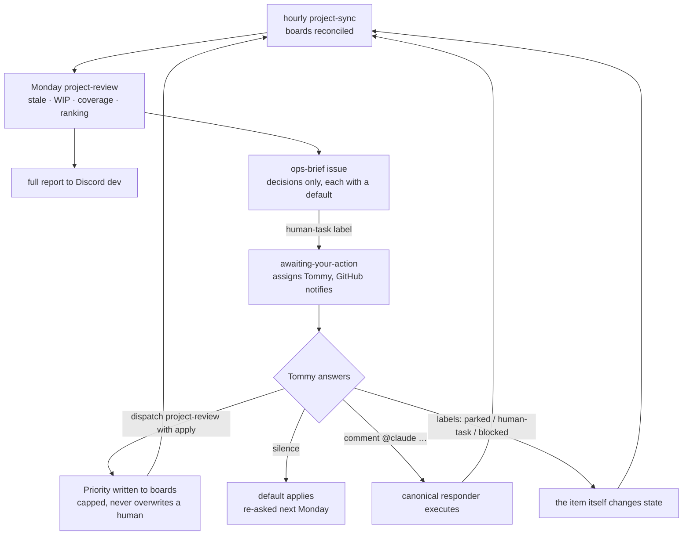

# Operations — inversion of control

> Canonical reference for how the robogeosociety org is run. The short version:
> **Claude manages the org; Tommy makes the decisions.** The machinery drives the
> cadence, surfaces the choices, reviews the work — and every question it asks
> carries a default, so an unanswered question never stalls anything.

## The inversion

The old posture: a human reads CI results, project boards, wiki summaries and
Discord posts, and tries to reconstruct "what should happen next" from the feed.
The feed always wins — there is more of it every week, and synthesis is exactly
the work a person does worst at 11pm.

The inverted posture: the automation does the synthesis and the human does only
what automation can't — **decide**. Concretely:

- **Claude proposes; Tommy disposes.** Rankings, staleness verdicts, WIP
  breaches and policy gaps arrive as *questions with defaults*, not as raw data.
- **Silence is an answer.** Every question states what happens if it goes
  unanswered (usually: nothing changes, and it re-asks next Monday). Nothing
  ever blocks waiting on a human; nothing destructive ever happens without one.
- **The levers are the existing machinery.** Labels, board moves, policy-file
  PRs and `@claude` comments — answering a question uses the same GitHub posture
  the org already had, not a new inbox.

## The loop

## Cadences

| When | What | Writes anything? |
|------|------|------------------|
| hourly | `project-sync` reconciles board #7, captures new open work | board columns only |
| Monday 08:00 UTC | `project-review` — stale, WIP, coverage, priority ranking → Discord `#dev` | nothing (report) |
| Monday, same run | **ops brief** — one `human-task` issue in this repo, decisions only | one issue, its own |
| on `proposal` label (issue) | **design review** — problem framing, alternatives, blast radius, questions for Tommy | one comment (+ `human-task` if a decision is needed) |
| on PR opened / ready | **code review** — correctness of the diff | one comment (+ `blocked` only for break-main defects) |
| on PR opened / edited | structure gate (hard) + style review (soft) on the description | comment / check |
| daily 14:47 UTC | **breach check** — reads a day of `#dev` for posts that indicate the workflow was bypassed (deploys around the gate, "pending Tommy" with no issue, decisions that never landed on a board) | card to `#dev`; a sticky `workflow-breach` + `human-task` issue only on findings |
| daily 15:17 UTC | **alarm audit** — reads a day of `#ops` for pages that don't fit the org's accumulated context (zombie alarms for retired services, recoveries with no failure, groundhog pages, miscalibrated severities), judged with the dev vault over Vectorize | card to `#dev`; a sticky `alarm-anomaly` + `human-task` issue only on findings |
| weekly (Mac mini) | fleet-sync standardizes every repo from this one | PRs, never direct pushes |

## Decision rights

**Tommy alone decides:** what gets priority, what gets parked or closed, WIP
limits and policy (`standard/project-policy.yml` — always via PR, so every
change has a diff and a why), whether a `blocked` hold is lifted, anything
destructive or outward-facing.

**Claude decides without asking:** how to execute an answered decision, board
reconciliation within policy, review verdicts (advisory), everything reversible
inside a repo that a merged answer implies.

**Defaults doctrine:** a question without a default is a nag, and a default
that mutates is a trap. So every ops-brief decision states its default, and the
default is always the *non-mutating* branch — stays open, stays a suggestion,
reported again. The system gets more autonomous only by Tommy ratcheting policy
(e.g. flipping the weekly run to `--apply`), never by drifting.

## Keeping the machinery honest

An org managed by agents needs the agents audited by something other than
themselves. The safeguards are structural, not aspirational:

- **Review is baked in, not requested.** Every non-draft PR gets a correctness
  review of its diff; every `proposal` issue gets a design review before code
  exists. Neither can be forgotten because neither is voluntary; both can be
  bypassed per-item with a visible `skip-*` label.
- **One tooth, human-reversible.** The code review may apply `blocked` — which
  holds the automerge lane and pings Tommy — only for break-main / data-loss /
  secret-leak findings. Removing the label overrules it; the disagreement stays
  on the record.
- **Non-mutation by default.** The weekly review closes, labels and comments on
  nothing. Priority writes require an explicit `--apply`, cap at 25 per run, and
  never overwrite a priority a human set.
- **Undercounting is declared, not suffered.** The report states what its token
  could not see, first, before any number that depends on it.
- **`parked` means parked.** Labeling an item `parked` removes it from every
  staleness nag — a decision made once stays made.
- **The channels are audited against the constitution.** `#dev` is where the
  machinery confesses; the daily breach check reads it against the rules digest
  in `ops/dev_breach.py` and surfaces posts that look like the workflow was
  stepped around. `#ops` is where the machinery pages; the daily alarm audit
  (`ops/alarm_audit.py`) reads it against the org's accumulated context — the
  vault, the named alarm classes, the window itself — and surfaces pages that
  don't make sense: monitoring drift, not incident volume. In both, a finding
  is a question, not a verdict — it changes nothing on its own, and a refuted
  finding is a prompt to tighten the digest.

## Where things live

- `ops/project_review.py` — the Monday review and the ops brief (`--brief`).
- `standard/project-policy.yml` — WIP limits, staleness thresholds, exemptions.
- `scripts/labels.tsv` — the label taxonomy, i.e. the decision vocabulary.
- `.github/workflow-templates/` — canonical workflows, synced fleet-wide by
  `scripts/sync.sh`; this repo vendors `claude.yml` and
  `awaiting-your-action.yml` into its own `.github/workflows/` because the sync
  skips itself.
- `PR_FRAMEWORK.md` — how PR descriptions are written and gated.
